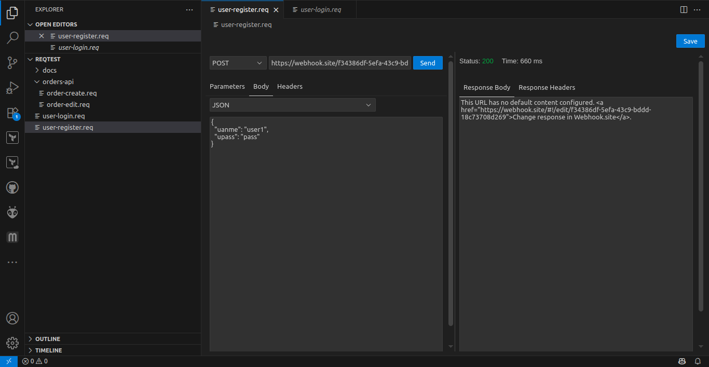

# reqstudio 🚀

[](https://opensource.org/licenses/MIT)
[](https://marketplace.visualstudio.com/items?itemName=sapandang.reqstudio)
[](https://github.com/your-username/reqstudio/actions)

**reqstudio** is a powerful, open-source HTTP and REST API client that lives directly inside Visual Studio Code. It provides a rich, graphical interface for creating, sending, and testing API requests, all managed through simple, text-based `.req` files.

Stop switching windows to test your APIs. Keep your API requests version-controlled alongside your code.

***

### ✨ **A picture is worth a thousand words!** ✨


---

## Features

* **📝 Custom Editor for `.req` Files**: A full-featured UI for any file ending in `.req`.
* ** graphical interface**: Build requests visually—no need to write JSON by hand.
* **✔️ All HTTP Methods**: Supports GET, POST, PUT, DELETE, and more.
* **⚙️ Full Request Control**: Manage URL parameters, headers, and complex request bodies with ease.
* **🔄 Multiple Body Types**: Send data as JSON, XML, Text, x-www-form-urlencoded, and multipart/form-data with file uploads.
* **📁 Binary File Uploads**: Send binary data directly from a file.
* **✅ Toggable Parameters**: Temporarily enable or disable params and headers with a single click without deleting them.
* **🌊 Streaming Responses**: Handles large API responses gracefully by streaming the data, keeping the UI responsive.
* **📊 Rich Response Viewer**: View response status, time, headers, and the formatted response body.
* **💾 Version Control Friendly**: Since requests are saved as simple JSON in `.req` files, you can commit them to Git and track changes over time.

---

## Requirements

* Visual Studio Code version **1.103.0** or newer.

---

## Installation

1.  Open **Visual Studio Code**.
2.  Press `Ctrl+Shift+X` (or `Cmd+Shift+X` on Mac) to open the **Extensions** view.
3.  Search for `reqstudio`.
4.  Click **Install**.

---

## Getting Started

1.  **Create a file** in your project with the `.req` extension (e.g., `api.req`).
2.  **Open the file** in VS Code. The `reqstudio` UI will automatically appear.
3.  **Build your request** using the graphical interface:
    * Select the HTTP method (GET, POST, etc.).
    * Enter the request URL.
    * Add any necessary parameters, headers, or a request body.
4.  **Click "Send"** to execute the request.
5.  View the response in the panel on the right.
6.  Click **"Save"** or press `Ctrl+S` / `Cmd+S` to save your request configuration to the `.req` file.

### The `.req` File Format

Your requests are saved in a clean, human-readable JSON format. This allows you to easily view diffs in Git or even create requests programmatically.

```json
{
  "method": "POST",
  "url": "[https://api.example.com/users](https://api.example.com/users)",
  "params": [
    {
      "key": "isActive",
      "value": "true",
      "enabled": true
    }
  ],
  "headers": [],
  "bodyType": "application/json",
  "bodyText": "{\n  \"name\": \"Alex\"\n}",
  "bodyUrlEncoded": [
    {
      "key": "",
      "value": "",
      "enabled": true
    }
  ],
  "bodyMultipart": [
    {
      "key": "",
      "value": null,
      "type": "text",
      "enabled": true
    }
  ]
}
```

## 🤝 Contributing

This is an open-source project, and contributions are very welcome! If you'd like to help improve `reqstudio`, please feel free to file issues or submit pull requests.

### Development Setup

1.  **Fork** and **clone** the repository.
2.  Install dependencies: `npm install`
3.  Start the TypeScript compiler in watch mode: `npm run watch`
4.  Open the project in VS Code and press **`F5`** to launch the **Extension Development Host** window.
5.  Open or create a `.req` file in the new window to test your changes.

**Making a Contribution:**
1.  Create a new branch for your feature or bug fix: `git checkout -b my-new-feature`.
2.  Make your changes.
3.  Commit your changes and push them to your fork.
4.  Submit a **Pull Request** to the main repository.
