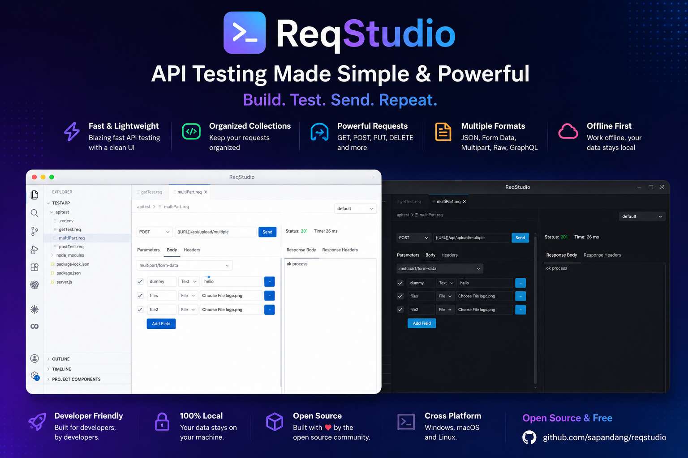

# reqstudio 🚀

[](https://opensource.org/licenses/MIT)
[](https://marketplace.visualstudio.com/items?itemName=sapandang.reqstudio)




**reqstudio** is a powerful, open-source HTTP and REST API client that lives directly inside Visual Studio Code. It provides a rich, graphical interface for creating, sending, and testing API requests, all managed through simple, text-based `.req` files.

Stop switching windows to test your APIs. Keep your API requests version-controlled alongside your code.

***


---

## Features

* **📝 Custom Editor for `.req` Files**: A full-featured, VS Code-themed UI for creating and managing `.req` API files visually.
* **📥 Import from cURL**: Paste cURL commands directly from Chrome/Firefox DevTools, Postman, or terminal to auto-populate request method, URL, headers, query params, auth, and payload body.
* **💻 Multi-Language Code Snippet Export**: Export any request to ready-to-use code snippets in cURL, JavaScript (`fetch`, `axios`), Python (`requests`), Go (`net/http`), and Java (`HttpClient`).
* **🍪 Automatic Cookie Jar & Session Tracking**: Automatically capture `Set-Cookie` response headers into named Cookie Jars (`Default Jar`, `user1_session`, `user2_session`) with instant multi-session switching and a built-in Cookie Manager.
* **✔️ All HTTP Methods**: Full support for `GET`, `POST`, `PUT`, `DELETE`, `PATCH`, `HEAD`, and `OPTIONS`.
* **⚙️ Full Request Control**: Manage URL query parameters, custom headers, and auth credentials (`Bearer`, `Basic`, `ApiKey`) with ease.
* **🔄 Multiple Body Types**: Send data as JSON, XML, Text, `x-www-form-urlencoded`, and `multipart/form-data` with file uploads.
* **🔍 Built-in Code Editor & Response Viewer**: Lightweight code editor with line numbers, syntax highlighting, JSON/XML prettifying, soft line wrapping, **Undo/Redo** (`Ctrl+Z`/`Ctrl+Y`), and **Find & Replace** (`Ctrl+F`).
* **📁 Binary File Uploads**: Send binary data directly from files.
* **✅ Togglable Parameters**: Temporarily enable or disable params, headers, and form fields with a single click.
* **🌊 Streaming Responses**: Handles large API responses gracefully by streaming data chunks without freezing the UI.
* **🔧 Environment Variables (`.reqenv`)**: Substitute variables (e.g. `{{URL}}`, `{{token}}`) into URLs, headers, auth, query params, and request bodies using workspace `.reqenv` files.
* **🔒 SSL Verification Control**: Easily toggle strict SSL certificate verification or allow self-signed certificates.
* **💾 Version Control Friendly**: Requests are saved as simple, readable JSON in `.req` files, making them git-friendly and easy to commit alongside your codebase.

---

## Requirements

* Visual Studio Code version **1.103.0** or newer.

---

## Installation

1.  Open **Visual Studio Code**.
2.  Press `Ctrl+Shift+X` (or `Cmd+Shift+X` on Mac) to open the **Extensions** view.
3.  Search for `reqstudio`.
4.  Click **Install**.

---

## Getting Started

1.  **Create a file** in your project with the `.req` extension (e.g., `api.req`).
2.  **Open the file** in VS Code. The `reqstudio` UI will automatically appear.
3.  **Build your request** using the graphical interface:
    * Select the HTTP method (GET, POST, etc.).
    * Enter the request URL.
    * Add any necessary parameters, headers, or a request body.
4.  **Click "Send"** to execute the request.
5.  View the response in the panel on the right.
6.  Click **"Save"** or press `Ctrl+S` / `Cmd+S` to save your request configuration to the `.req` file.

### The `.req` File Format

Your requests are saved in a clean, human-readable JSON format. This allows you to easily view diffs in Git or even create requests programmatically.

```json
{
  "method": "POST",
  "url": "[https://api.example.com/users](https://api.example.com/users)",
  "params": [
    {
      "key": "isActive",
      "value": "true",
      "enabled": true
    }
  ],
  "headers": [],
  "bodyType": "application/json",
  "bodyText": "{\n  \"name\": \"Alex\"\n}",
  "bodyUrlEncoded": [
    {
      "key": "",
      "value": "",
      "enabled": true
    }
  ],
  "bodyMultipart": [
    {
      "key": "",
      "value": null,
      "type": "text",
      "enabled": true
    }
  ]
}
```

### Using Environment Variables

You can manage environment variables to reuse values across multiple requests. This is useful for switching between development, staging, and production configurations without modifying each `.req` file.

**Creating an environment file**

Create a `.reqenv` file in your workspace root for global environments, or create a file named `<filename>.reqenv` next to a specific `.req` file for per-request environments.

Example `.reqenv` file:

```groovy
URL=http://localhost:3456
DATA1=456
```

**Substituting variables**


Inside your `.req` file, reference variables with double curly braces:

```json
{
  "method": "GET",
  "url": "{{baseUrl}}/users/{{userId}}",
  "headers": [
    {
      "key": "Authorization",
      "value": "Bearer {{apiKey}}"
    }
  ]
}
```

Variable substitution works in the URL, headers, and request body text fields.

**Selecting an environment in the UI**

When a `.req` file is open, use the environment selector dropdown in the request UI to pick the active environment. The active environment variables are applied automatically before the request is sent.

## 🤝 Contributing

This is an open-source project, and contributions are very welcome! If you'd like to help improve `reqstudio`, please feel free to file issues or submit pull requests.

### Development Setup

1.  **Fork** and **clone** the repository.
2.  Install dependencies: `npm install`
3.  Start the TypeScript compiler in watch mode: `npm run watch`
4.  Open the project in VS Code and press **`F5`** to launch the **Extension Development Host** window.
5.  Open or create a `.req` file in the new window to test your changes.

**Making a Contribution:**
1.  Create a new branch for your feature or bug fix: `git checkout -b my-new-feature`.
2.  Make your changes.
3.  Commit your changes and push them to your fork.
4.  Submit a **Pull Request** to the main repository.
